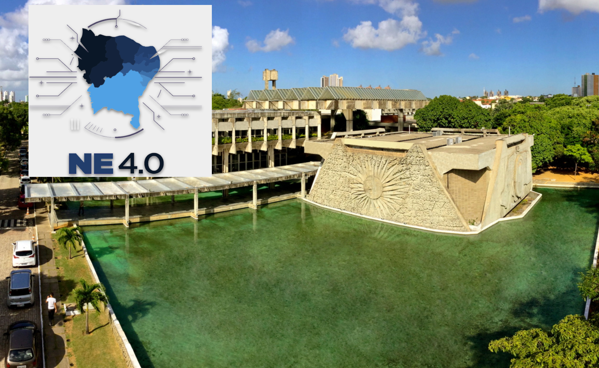

# Residência em Indústria 4.0

O curso tem caráter de pós-graduação lato sensu e faz parte do “Programa de Revitalização da Indústria Nordestina - NE4.0”, resultado de uma parceria entre diversas Universidades do Nordeste (UFRN, UFPB, UPE, entre outras) e a Sudene. O [programa](https://www.gov.br/sudene/pt-br/assuntos/noticias/paraiba-e-rio-grande-do-norte-iniciam-residencia-em-industria-4.0) propõe a ampliação e adoção de novas tecnologias por parte das indústrias da região, envolvendo diversos segmentos e capacitando mão de obra de alta qualificação.

## Curso - Inteligência Artificial

### Referências

- :books: Jason Brownlee. Machine Learning Mastery With Python. [[Link]](https://machinelearningmastery.com/machine-learning-with-python/)
- :books: Jason Brownlee. Data Preparation for Machine Learning. [[Link]](https://machinelearningmastery.com/data-preparation-for-machine-learning/)
- :books: Aurélien Géron. Hands on Machine Learning with Scikit-Learn, Keras and TensorFlow. [[Link]](https://www.oreilly.com/library/view/hands-on-machine-learning/9781492032632/)
- :books: Noah Gift, Alfredo Deza. Practical MLOps: Operationalizing Machine Learning Models [[Link]](https://www.oreilly.com/library/view/practical-mlops/9781098103002/)

### Conteúdo

**Aula 01** Apresentação do curso 
- Motivação, conteúdo, calendario, outros.